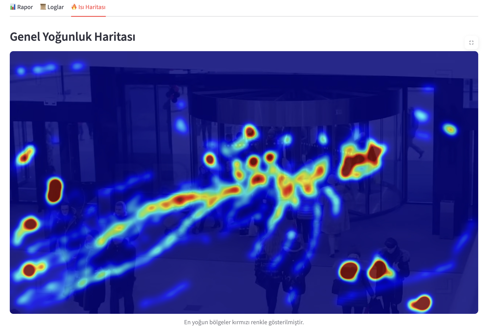
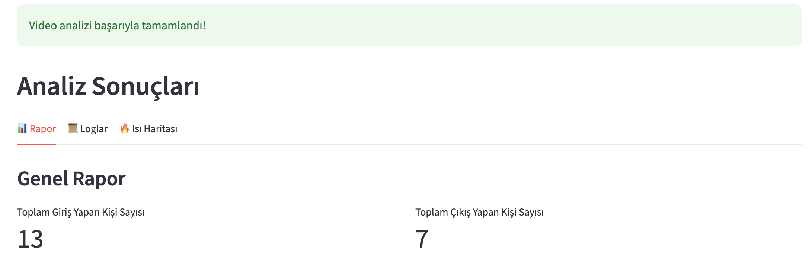
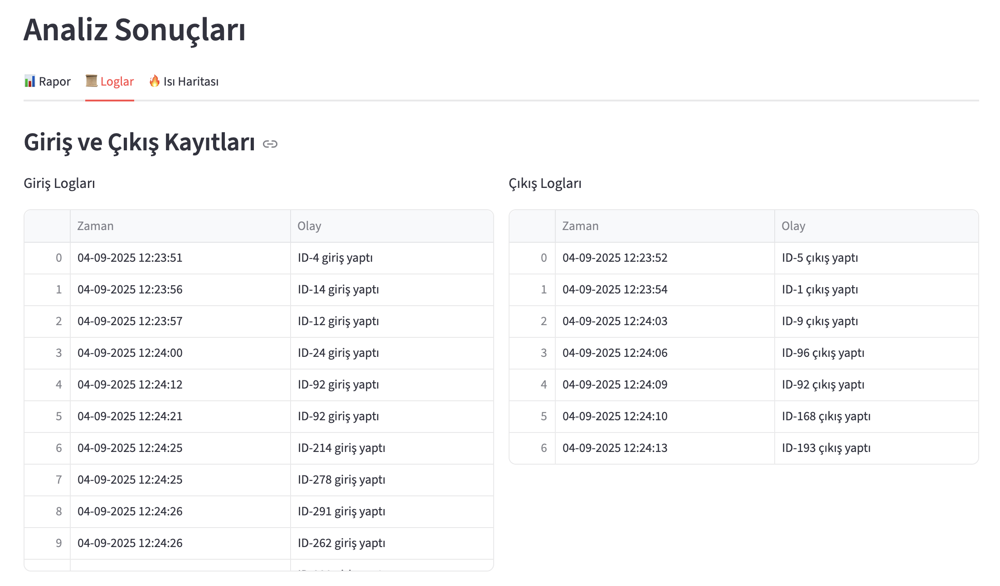

# Gerçek Zamanlı Alan Analizi ve Yoğunluk Takibi
Bu proje, bir video kaynağından (IP kamera, video dosyası vb.) alınan görüntüleri gerçek zamanlı olarak işleyerek mağaza, AVM, etkinlik alanı gibi fiziksel mekanlarda insan yoğunluğunu ve akışını analiz eden bir bilgisayarlı görü uygulamasıdır. Elde edilen veriler, interaktif bir web arayüzü üzerinden sunulur ve detaylı raporlar halinde kaydedilir.
---

## 🌟 Özellikler
- **Gerçek Zamanlı Kişi Sayımı ve Takibi:** Görüntüdeki her bir kişiyi tespit eder, onlara benzersiz bir ID atar ve anlık olarak toplam kişi sayısını gösterir.

- **Giriş/Çıkış Analizi:** Belirlenen sanal bir çizgiyi geçen kişileri yönlerine göre sayarak mekana giren ve çıkan kişi sayısını kaydeder.

- **Yoğunluk Haritası (Heatmap):** Analiz süresi boyunca insanların en çok vakit geçirdiği veya en sık kullandığı "sıcak" bölgeleri gösteren görsel bir ısı haritası oluşturur.

- **İnteraktif Web Arayüzü:** Streamlit kullanılarak geliştirilmiş, kullanıcı dostu bir arayüz üzerinden tüm analiz sonuçlarını (canlı video, raporlar, loglar, ısı haritası) sunar.

- **Detaylı Raporlama:** Her analiz seansı sonunda toplam giriş/çıkış sayılarını, olay loglarını ve ısı haritasını içeren JSON, CSV ve PNG formatlarında raporlar oluşturur.

## Sonuçlardan Örnek Görseller
### İnsan Tespiti ve Sayımı


### Heatmap


### Analiz Sonuçları


### Loglar



Canlı Analiz Ekranı (Kişi Sayımı ve Giriş/Çıkış)
Anlık olarak tespit edilen insanlar, takip ID'leri ve giriş/çıkış sayaçları bu ekranda gösterilir.

Yoğunluk Haritası (Heatmap)
Videonun tamamı boyunca en yoğun insan trafiğinin olduğu bölgeler kırmızı renkle gösterilir.

Streamlit Rapor Paneli
Tüm sonuçların sekmeler halinde sunulduğu interaktif web arayüzü.


## 🛠️ Teknoloji Yığını

- **Dil:** Python 3.x  
- **Bilgisayarlı Görü:** OpenCV, Ultralytics YOLOv8  
- **Web Arayüzü:** Streamlit  
- **Veri İşleme:** Pandas, NumPy  

---
```
Bilgisayarlı Görü: OpenCV, Ultralytics YOLOv8

Web Arayüzü: Streamlit

Veri İşleme: Pandas, NumPy
```
---

### Gerekli kütüphaneleri yükleyin:
```bash
pip install -r requirements.txt
```
---

### Kullanım
Uygulamayı başlatmak için projenin ana dizininde terminali açın ve aşağıdaki komutu çalıştırın:
```bash
streamlit run app.py
```
Bu komut, varsayılan web tarayıcınızda uygulamayı otomatik olarak açacaktır. Arayüz üzerinden analiz etmek istediğiniz videoyu yükleyebilir ve sonuçları görüntüleyebilirsiniz.

---
## 📂 Proje Yapısı

Proje, modüler bir yaklaşımla geliştirilmiştir. Ana bileşenler ve görevleri aşağıdaki gibidir:

- **`app.py`** → Streamlit ile oluşturulmuş, tüm analizi yöneten ve sonuçları sunan ana web uygulaması  
- **`video_stream_manager.py`** → Video dosyasını veya kamera akışını okumaktan ve kareleri (frame) sağlamaktan sorumlu modül  
- **`person_detect_and_tracking_engine.py`** → YOLOv8 modelini kullanarak insanları tespit eden ve benzersiz takip ID’si atayan işlem motoru  
- **`entry_exit_counter.py`** → Sanal çizgiyi geçen nesneleri sayarak giriş/çıkış istatistiklerini tutan sınıf  
- **`density_map_generator.py`** → İnsanların konum verilerini toplayarak görsel yoğunluk haritası oluşturan modül  
- **`report_generator.py`** → Sonuçları JSON, CSV ve PNG formatlarında kaydeden rapor oluşturucu  
- **`requirements.txt`** → Projenin çalışması için gerekli tüm Python kütüphaneleri  
- **`reports/`** → Oluşturulan tüm rapor dosyalarının kaydedildiği klasör  
- **`README.md`** → Projeyi tanıtan, kurulum ve kullanım talimatlarını içeren dosya